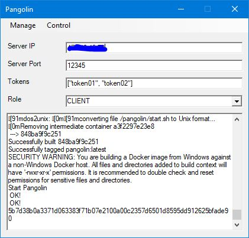

# Pangolin

Pangolin is a Go implenmentation of TUN VPN. 
* Support Tcp/Udp connection.
* For Tcp, it supports multi-user authentication, encryption transmission. For Udp, no authentication.
* Using Docker, it supports Linux/Windows/Mac.
* For client, it supports Linux/Windows/Mac/Android.

## Quick Start
The pangolin can only run natively on Linux. But you can use docker to run it on Windows and Mac.

### Prerequisite
* Install latest Docker(For windows, Hyper-V and Linux Container).
* Root/Administrator account.

### Windows 10

#### Install
Run ```pangolin_win.ps1``` with Powershell and click menu ```Manage->Install```. Installation will take several minutes.
#### Run
* Type in your own ```Server Ip/Server Port/Tokens/Role```.
* Click ```Control->Start/Stop```.

### Linux
#### Install
```bash pangolin_linux.sh install```
#### Run
* Configure the pangolin_linux.sh
```bash
SERVERIP="0.0.0.0"
SERVERPORT="12345"
TOKENS='["token01", "token02"]'
ROLE="SERVER"
...
```
* Start: ```bash pangolin_linux.sh start```
* Stop: ```bash pangolin_linux.sh stop```

### Mac
* Not test yet, but I think it's ok. Maybe you can help :)

### Android Client
* [Android Client](https://github.com/xitongsys/pangolin-android)

## Run in Docker
### Build Docker Image
Go to the docker directory and build your own docker image.
```
docker build -t pangolin .
```
### Run Docker Image
* Run your docker image on server and client sparately. 

Server
```
docker run --cap-add NET_ADMIN --cap-add NET_RAW --device /dev/net/tun:/dev/net/tun --net host --env ROLE=SERVER --env TOKEN='["token01", "token02"]' --env SERVERPORT=12345 --env SERVERIP='0.0.0.0' pangolin
```

Client
```
docker run --cap-add NET_ADMIN --cap-add NET_RAW --device /dev/net/tun:/dev/net/tun --net host --env ROLE=CLIENT --env SERVERIP=137.140.40.78 --env SERVERPORT=12345 --env TOKEN='["token01"]' pangolin
```

### Run Docker Image on Windows
* Follow this [link](https://docs.docker.com/machine/drivers/hyper-v/#2-set-up-a-new-external-network-switch-optional) to create an external VMSwitch and a new docker machine.
* Use the new docker machine and follow the steps of Linux.
* Change your windows host default gateway to the docker
```
route delete 0.0.0.0
route add 0.0.0.0 mask 0.0.0.0 192.168.0.13
#192.168.0.13 is your docker public ip.
```

## Run natively
The pangolin can only run natively on Linux and you need to configure the host net environment.
### Configuration File
The config file is json format like
```json
{
    "role": "server",
    "server": "0.0.0.0:12345",
    "tun": "10.0.0.2/8",
    "tunname": "tun0",
    "dns": "8.8.8.8",
    "mtu": 1500,
    "protocol": "tcp",
    "tokens": ["token01", "token02"]
}
```
### Network Configuration
#### Server
```bash
	ip tuntap add dev tun0 mod tun
	ip addr add 10.0.0.2/8 dev tun0
	ip link set tun0 up
	ip=`ip addr show dev "eth0" | awk '$1 == "inet" { sub("/.*", "", $2); print $2 }'`
	iptables -t nat -F
	iptables -t nat -A POSTROUTING -o eth0 -j SNAT --to-source $ip
	iptables -P FORWARD ACCEPT
```
#### Client
```bash
	ip tuntap add dev tun0 mod tun
	ip addr add 10.0.0.22/8 dev tun0
	ip link set tun0 up
	iptables -t nat -F
	iptables -t nat -A POSTROUTING -o tun0 -j SNAT --to-source 10.0.0.22
	iptables -P FORWARD ACCEPT
	
	gw=`route -n | awk '$1 == "0.0.0.0" {print $2}'`
	route add $SERVERIP gw $gw
	route add default gw 10.0.0.1
	echo "nameserver 8.8.8.8" > /etc/resolv.conf
```

## Status
This project is still in progress and you can contribute to it. Anything is welcome !
* Test on Mac 
* iOS client
* Improve Android client
* Improve windows powershell script to support Win7
* Add UT/Doc


